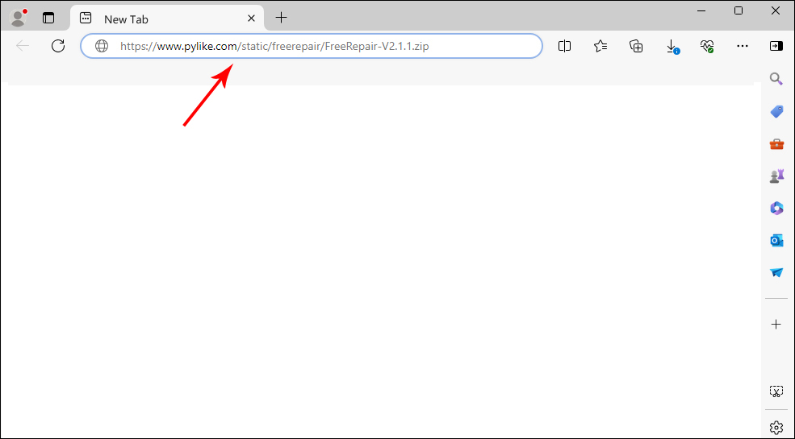
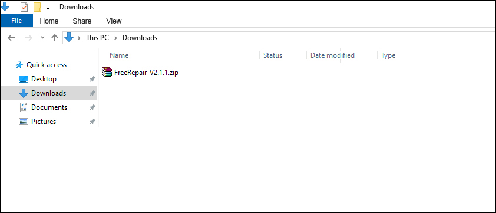
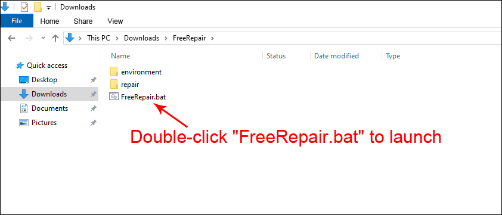
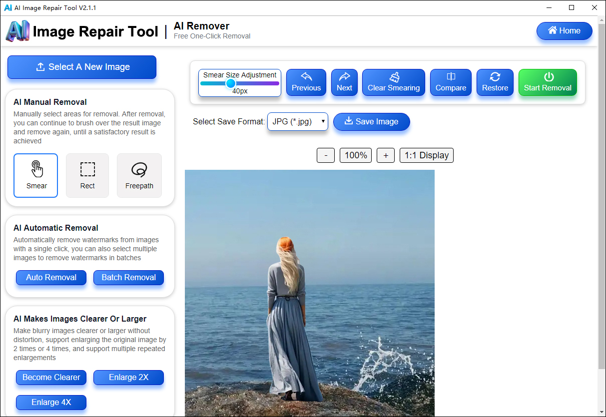

# Free And Open-Source AI Watermark Remover & Make Blurry Images Clearer Or Larger Tool - FreeRepair, Simulation IOPaint Based On The Django Of Python With No Sign-Up

### FreeRepair: A Free And Open-Source AI Image Repair Tool With No Sign-Up

**Are you still troubled by annoying watermarks, unexpected passersby, or clutter in your pictures?**

These little imperfections can ruin what would otherwise be a perfect shot, and traditional editing methods often consume hours of your time and require advanced skills. Now, thanks to Free AI tools like **FreeRepair**, you can remove unwanted elements and restore your images effortlessly. Simply brush over the area you wish to remove, and the AI automatically analyzes the surrounding environment and intelligently fills in the background content, with a natural transition that almost leaves no traces of modification, giving you clean, professional‑looking results in seconds.

### What Is FreeRepair?

**FreeRepair** is an image repair tool powered by the latest AI models. Leveraging the Django framework of Python in conjunction with LaMa model technology, it can precisely remove objects or watermarks, It can also make blurry old images clearer with just one click, enlarge images without distortion, and supports the batch removal of watermarks from multiple images.

Unlike web-based editors where you upload an image to a server for processing, FreeRepair runs entirely on your local computer. This means your photos never leave your computer, ensuring complete data privacy.

### Core Function

**One-Click Operation:** The simple and intuitive interface requires no prior editing experience. The tool allows users to complete image restoration tasks with a single click—simply by "brushing over" or "selecting an area." Even beginners with no prior professional editing experience can quickly master the technique and achieve professional-quality restoration results.

**Make Photos Clearer Or Larger:**  For photo restoration, FreeRepair specializes in blurry photo repair, restoring old, blurry photos to their former clarity, while Real-ESRGAN offers super-resolution enhancement, allowing users to upscale low-resolution images by up to 2x or 4x without losing detail.

**Batch Removal:**  It supports batch removal of watermarks from multiple images in a folder. Massive images can be processed at once, and the exported images remain high-definition and lossless. It's simple and efficient. This feature drastically reduces the time spent on repetitive tasks, as a valuable tool for photographers, marketers, and anyone working with large volumes of images.

**Privacy-First:** Because the software runs locally on your computer, your images are never uploaded to third-party servers. This makes it ideal for sensitive or private photo editing.

**Cost:** It is completely free to use, with no subscriptions or credit limits, though it requires your own computer to process the images. The tool supports both CPU and GPU acceleration, ensuring fast performance even on less powerful hardware.

### FreeRepair Download

**Windows One Click Download:** If you are using the Windows system, you can download the original project files with one click. After downloading, double-click to start FreeRepair. No installation, no internet connection, it works out of the box, safe and secure.

### FreeRepair Download Link

**FreeRepair Project Download Link：** https://www.pylike.com/static/freerepair/FreeRepair-V2.1.1.zip

**Note:** You can download the file by visiting the URL above using any browser.

**Detailed Download Instructions:** Simply enter "https://www.pylike.com/static/freerepair/FreeRepair-V2.1.1.zip" directly into your browser's address bar. Once you press the "Enter" key on your keyboard, the browser will immediately begin downloading the file. Please note that some browsers may display a dialog box asking if you wish to save the file; clicking the "Save" button will automatically store the file in your browser's default "Downloads" folder, as illustrated in the figure below.

### Open FreeRepair

As shown in the above figure, after downloading, the FreeRepair-V2.1.1.zip compressed file is obtained. After decompressing the compressed file, a folder named "FreeRepair" appears, containing all project files, and this "FreeRepair" folder can be copied and stored in any location on the computer. No installation or configuration is required, and do not modify the components in the "FreeRepair" folder at will. After clicking into the "FreeRepair" folder, you will find a startup file named "FreeRepair.bat". Simply double-click "FreeRepair.bat" to launch the FreeRepair tool, as illustrated in the figure below.

